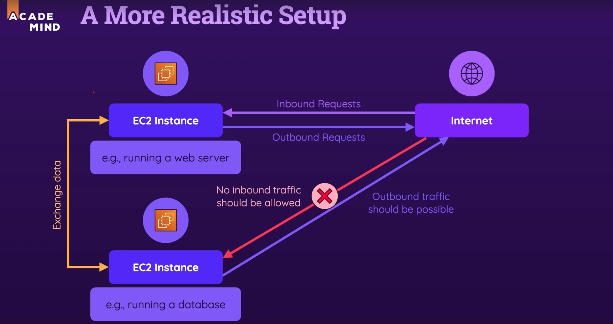

# VPC Notes

## Inboud VS Outbound

As per image above, you want to block inbound traffic to your instance that is hosting the web database because you only want your web server to CRUD it. However, you do want the instance to be able to connect **outbound** to get updates of the latest version.

## Route Tables

NAT Gateway must be in a public subnet.

You use `AAAA` for IPv6 address for in `Hosted Zones`.

### NACL

- NACL is a firewall at a subnet level.
- It either only ALLOW or DENY.
- Stateless (SG is Stateful)
- Process rules in order.
- NACL is useful to blocking a certain IP address from trying to reach your instance.
